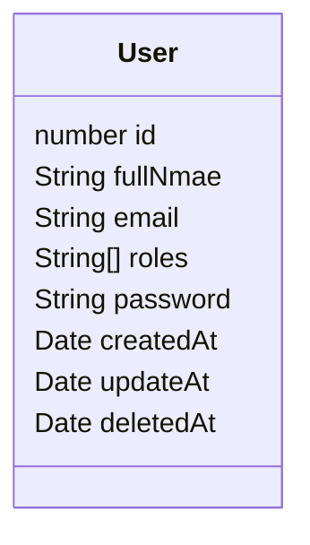

# About
This is a boilerplate project for NestJS with authentication. Use it as a base to add JWT-based auth guards to your applications.

# Technologies being used


[</img>](https://nestjs.com/)
[</img>](https://www.postgresql.org/)
[</img>](https://www.usebruno.com/)
[</img>](https://www.npmjs.com/package/bcrypt)

# User class



# Getting started

Copy and fill .env file
```bash
cp -R .env.example .env
```

Install all the packages
```bash
npm i
```

Run (development mode)
```bash
npm run start:dev
```

You can turn off the database logging at `app.module.ts`


# Plannings

* [x] Communication with Postgres
* [x] User Class
* [x] JWT Auth
* [x] Use Guards and Strategies
* [x] Bcrypt passwords
* [ ] User CRUD endpoints
* [x] Protect endpoints by user role
* [ ] ts-check documentation
